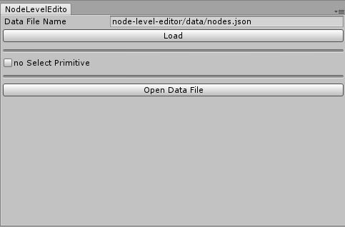
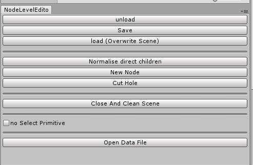
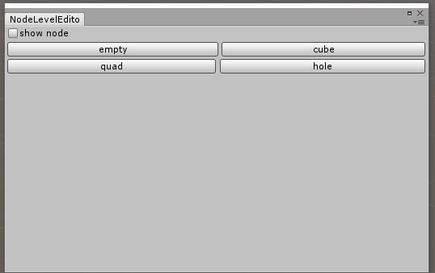
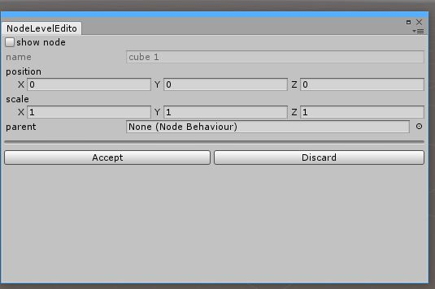

# node-level-editor

Unity3d Editor tools to create rooms quickly. 

These tools are in the beta stage of development, while they should be safe to use in existing scenes it is advised to use them in an new scene to start with.

## Features

* [Install](#install)
    * [Unity Tests](#test)
* [Overview](#overview)
* [Create Nodes](#create)
    * [onNodeCreation Event](#create_event)
* [Create nodes from cubes](#create_cubes)
* [Cut Holes](#holes)
* [JSON data](#json_data)
* [Known Issues and Planned Features](#known_issues)

## Install 

Copy code from the source folder to Assets folder in unity project.

### Unity Tests 

There are a few tests that can be run by unity to make sure some parts of this project work. Check [here](https://docs.unity3d.com/Manual/testing-editortestsrunner.html) for details on running tests in unity.

## Overview 

This tool was created to help the creating of room based scene in unity. Boxes made of 6 quad facing inwards, and the ability to cut holes in these quads will allow you to prototype levels quickly. 

An Example can be seen [here](https://pbs.twimg.com/media/DTZ3_ZjXkAAwMoZ.jpg).

The scripts save the data about the current nodes in a json file. When you open a scene you can select when where data will be loaded from and saved to. You can also open the data file and edit it manually, details [here](#json_data). The scripts will create a `ROOT` node that will be the default parent of any other node. 

After changes are made to nodes in the scene the save button must be press to make those changes save to the data file. Unloading and reloading will destroy all nodes in the current scene.

## Create Nodes 

Pressing the `New Node` button will open a new window that allows you to create a new node.

There are 4 types of nodes:
* Empty nodes are basically empty gameobjects, they can be useful to group other nodes together
* Cube nodes are boxes with 6 inward facing quads
* Quad node are a single gameobject with quad mesh render and collider
* Hole nodes target quad nodes and split then in order to create a hole

Name of nodes needs to be unique so the scripts will set a name based on the type.

The position and scale of the node work the same way as regular transforms in unity expect for holes. For hole nodes the position is the location of the hole relative to the target quad and the scale is the size relative to the target quad.

The Show node button will attempt to show the node you are creating in the scene, this may not work well with hole nodes.

The parent of a node works the same way as regular transforms in unity.

Accepting the node will close the window and add the node to the scene. **The data will still need to be saved**

### onNodeCreation Event 

## Create nodes from cubes 

## Cut Holes 

## JSON data 

## Known Issues and Planned Features 

Known bugs and planned features will be added to [this](https://trello.com/b/juzrW6Ba/node-level-editor) Trello board

If you find a bug while using the tool or just have a suggestion please create a new issue on github or tweet [@JamesFrowenDev](https://twitter.com/JamesFrowenDev) 

